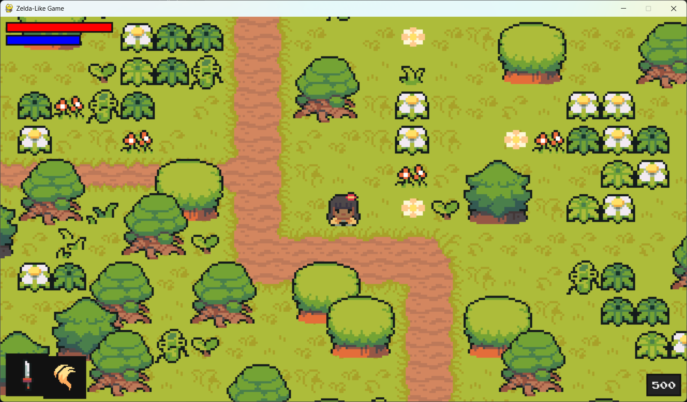

# Zelda-Like Action RPG

A top-down action adventure RPG built in Python using the **Pygame** library. This project features real-time combat, magic casting, an upgrade system, a custom depth-sorting camera, and a dynamic HUD.

## 📸 Application Preview
Here is a preview of the game:



## Features

- **Fluid Combat**: Attack enemies in 4 directions using various weapons (Sword, Lance, Axe, Rapier, Sai), each with unique speed, cooldowns, and damage stats.
- **Magic Spells**: Cast powerful spells using player energy:
  - **Heal**: Restore health with a glowing aura effect.
  - **Flame**: Unleash a fire stream in your facing direction.
- **Upgrade System**: Earn experience points (EXP) by defeating monsters and press `M` to open the Upgrade Menu. Spend EXP to upgrade stats:
  - Health & Energy (increases maximum bounds)
  - Attack Damage & Magic Power
  - Movement Speed
- **Dynamic Camera & Depth Sorting**: Features a custom camera group (`YSortCameraGroup`) that centers on the player and renders sprites dynamically sorted by their vertical coordinate, creating a natural 2D depth perspective.
- **Heads-Up Display (HUD)**: Keep track of health, energy, active weapon/magic selections, and current EXP in real-time.
- **Various Enemy Types**: Face unique monsters including Raccoons, Squids, Spirits, and Bamboo, each with distinct AI behavior, speeds, attack types, and sound effects.

## Controls

- **Move**: `Arrow Keys` (Up, Down, Left, Right)
- **Melee Attack**: `Spacebar`
- **Cast Magic**: `Left Ctrl`
- **Switch Weapon**: `Q`
- **Switch Magic**: `E`
- **Toggle Upgrade Menu**: `M`

## Getting Started

### Prerequisites

You need **Python 3.x** and **pip** installed.

### Installation

1. Clone or download this repository to your local machine.
2. Open your terminal/command prompt, navigate to the project directory, and install the required dependencies:
   ```bash
   pip install -r requirements.txt
   ```

### Running the Game

Run the main game script from the project root directory:
```bash
python code/main.py
```
